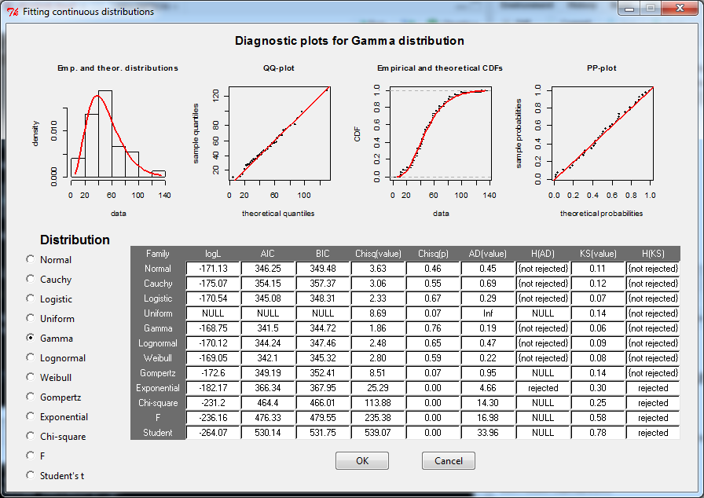

<!-- README.md is generated from README.Rmd. Please edit that file -->
rriskDistributions
==================

[](http://cran.r-project.org/package=rriskDistributions) [](https://travis-ci.org/mattflor/rriskDistributions)

`rriskDistributions` is a collection of functions for fitting distributions to given data or known quantiles.

The two main functions `fit.perc()` and `fit.cont()` provide users a GUI that allows to choose a most appropriate distribution without any knowledge of the R syntax. Note that this package is part of the [rrisk](http://www.bfr.bund.de/en/rrisk__risk_modelling_and_auto_reporting_in_r-52162.html) project.

E.g., we can fit random data generated from a gamma distribution with `fit.cont()`:

``` r
res <- fit.cont(data2fit = rgamma(n = 37, shape = 4, rate = 0.08))
```

This will open a new window where the user can inspect diagnostic plots for a variety of possible distributions and then choose the distribution she wants to continue working with (the chosen distribution will be stored in the `res` variable):



Updating to the latest version of rriskDistributions
----------------------------------------------------

You can track (and contribute to) development of `rriskDistributions` at <https://github.com/mattflor/rriskDistributions>. To install it, run the following command (this requires the `devtools` package):

``` r
devtools::install_github("mattflor/rriskDistributions")
```

Authors
-------

-   Natalia Belgorodski (STAT-UP Statistical Consulting)
-   Matthias Greiner (Federal Institute for Risk Assessment, Germany)
-   Kristin Tolksdorf (Federal Institute for Risk Assessment, Germany)
-   Katharina Schueller (STAT-UP Statistical Consulting)

With contributions from

-   Lutz Göhring (Lutz Göhring Consulting)
-   Matthias Flor (Federal Institute for Risk Assessment, Germany)
